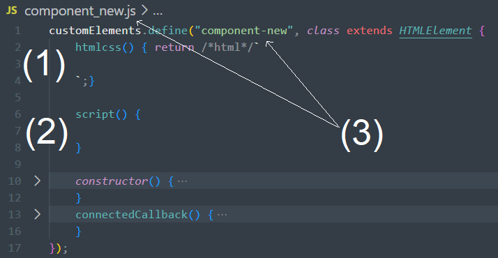

# Instructions:
<!-- 1. Build component html/css within template-string of `htmlcss()`
2. Build component js within `script()`
3. Rename: filename `component_new.js` & code `component-new` -->

1. Rename: filename `component_new.js` & code `component-new`
2. Build component css, html, and js in respective functions
    - Note: css and html functions are built as html-template strings

# Usage:
1. Add `` to head of target html file
2. Add `<component-new></component-new>` to body of target html file

# Shadow DOM Option:
- `component_new.js` is built without a shadow DOM. The contents of the component can be easily manipulated by the parent document's code/styling
- `component_newshadow.js` is built with a shadow DOM that has independent styling
