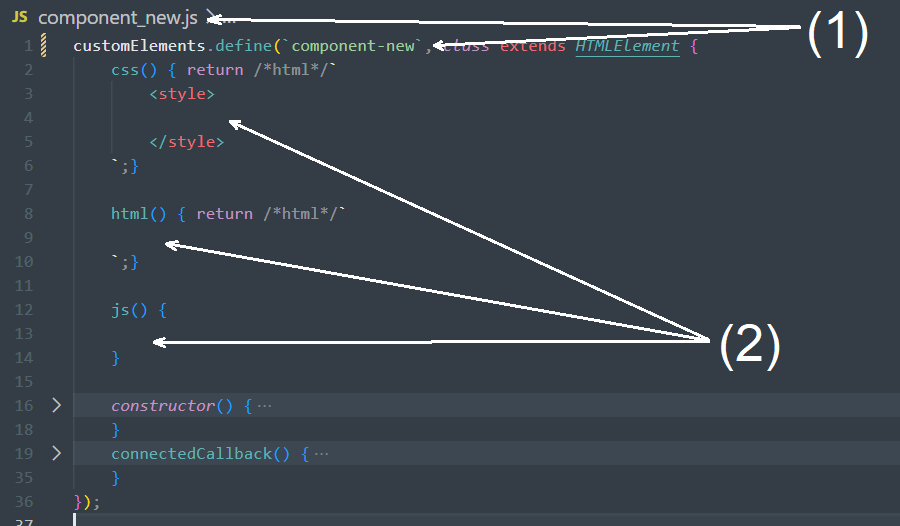

# Instructions:
1. Build component html/css within template-string of `htmlcss()`
2. Build component js within `script()`
3. Rename: 
    - code `ComponentNew` & `component-new`
    - filename `component_new.js`

# Usage:
1. Add `` to head of target html file
2. Add `<component-new></component-new>` to body of target html file